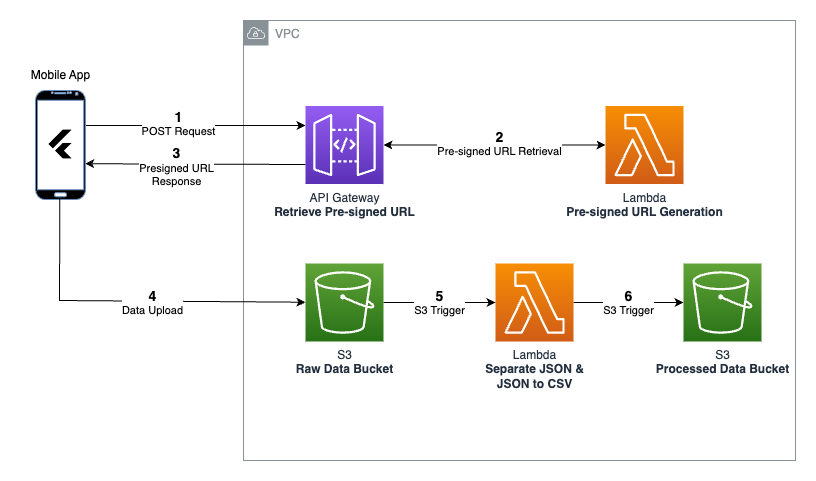

# Parkinson's Survey App Backend

Cloud storage solution to store study results collected in the [Parkinson's Survey App](https://github.com/UBC-CIC/parkinsons-survey-app).
| Index                                               | Description                                             |
| :-------------------------------------------------- | :------------------------------------------------------ |
| [High Level Architecture](#high-level-architecture) | High level overview illustrating component interactions |
| [Deployment](#deployment-guide)                     | How to deploy the project                               |
| [Changelog](#changelog)                             | Any changes post publish                                |
| [Credits](#credits)                                 | Meet the team behind the solution                       |
| [License](#license)                                 | License details                                         |

# High Level Architecture

The following architecture diagram illustrates the various AWS components utliized to deliver the solution. For an in-depth explanation of the frontend and backend stacks, refer to the [Architecture Deep Dive](docs/ArchitectureDeepDive.md).

# Deployment Guide

To deploy this solution, please follow our [Deployment Guide](docs/DeploymentGuide.md)

# Changelog

View the changelog [here](docs/Changelog.md)

# Credits

This application was architected and developed by Timothy Jin, with project assistance by Sophie Mok. A special thanks to the UBC Cloud Innovation Centre Technical and Project Management teams for their guidance and support.

# License

This project is distributed under the [MIT License](LICENSE).
